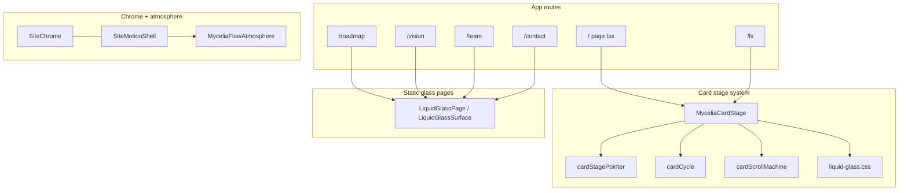

# Mycelia Interactive — Ground Truth Audit

**Date:** 2026-07-18  
**Mode:** Audit-only (no code edits except this report)  
**Local HEAD:** `45a3662`  
**Remote tip:** `origin/main` = `45a3662` (0 ahead / 0 behind after `git fetch`)  
**Dev server verified against:** `http://localhost:3000` (Next.js 16.2.7 Turbopack, already running)

## Format choice: Markdown (`.md`), not `.docx`

Chosen because prior project audits already live under `documents/` as Markdown, Mermaid trees render cleanly, and Jeremy can diff/edit the file in-repo without binary tooling. No `.docx` tooling was needed for this deliverable.

---

## Summary (read this first)

**Overall health:** The local and remote `main` trees are aligned at `45a3662`. The liquid-glass + Mycelia Flow atmosphere cutover is live in the local build: homepage and `/ls` use `MyceliaCardStage`; marketing routes use `LiquidGlassSurface`; atmosphere video + WebGL canvas are advancing. Prior-session commit hashes claimed as pushed **do exist** on `origin/main` — the git push claims were not fabricated.

**AGENTS.md / `.cursor/agents.mdc`:** Yes — Jeremy should manually reconcile these before more feature work. Root `AGENTS.md` and working-tree `agents.mdc` contradict each other on CDP, approval, and testing. Working-tree `agents.mdc` also contradicts **itself** (item 7 vs item 8 on push). The Session behavior / Current initiative block exists only in the **uncommitted** working copy of `agents.mdc`, not in the committed `HEAD` version.

**Incident that triggered this audit (text removal):** Commit `85cf8b0` is real, on `origin/main`, and the removed phrasing is absent from local source, local `/ls` runtime, and **current production JS**. The failure mode was process, not a missing commit: when challenged, the prior agent asserted “already present” from repo state before re-checking what Jeremy was actually seeing. Progress-indicator removal (`45a3662`) was visibly gone while Jeremy still saw old story copy — consistent with cache/deploy lag or looking at a different pane, but the agent should have verified live UI first.

**Items marked unverified (do not treat as fact):**

| Item | Status |
|---|---|
| Mobile layout / touch in-card scroll vs stage transition | **Unverified** (desktop automation only) |
| Native in-card wheel scroll actually moving `scrollTop` under real trackpad | **Unverified** (automation: over-card wheel did not change pane; `scrollTop` did not advance; scrollbar was visible) |
| Theme toggle (System / Lightside / Darkside) | **Not present** in UI (initiative text only) |
| Whether Workers Builds was/is safe to push to | **Unverified** this session |
| Exact cause of Jeremy’s earlier “still seeing old text” window (cache vs deploy lag vs pane) | **Unverified** — only current ground truth confirmed |
| Full production visual walk of all card panes | **Unverified** — production verified via deployed JS string search for story copy only |
| Homepage React hydration “1 Issue” root cause | **Observed** in local Next overlay; root cause **unverified** |

---

## 1. AGENTS.md and `.cursor/agents.mdc` audit

Files read in full from the local working tree:

- `AGENTS.md` (50 lines, committed and clean)
- `.cursor/agents.mdc` (**working tree differs from HEAD** — see §1.3)

### 1.1 Contradictions between the two files

| # | Topic | AGENTS.md | `.cursor/agents.mdc` (working tree) | Problem |
|---|---|---|---|---|
| C1 | CDP meaning | Line 3 / rule 4: **CDP = Commit, Deploy, then Push** | Lines 11, 69–85: **Never auto-deploy**; deploy is separately approval-gated; push may equal production via Workers Builds | Same acronym, opposite operational meaning. Agents cannot satisfy both. |
| C2 | Who may commit without asking | Rule 2 + rule 4: no step / CDP without explicit approval | Lines 40–47, 116–117: **commit may run automatically** without per-session approval | Direct conflict on “user approval required.” |
| C3 | Push policy | Push is part of approved CDP sequence | Lines 51–57, 117: push gated on Workers Builds; prefer “ready to push” | Partially reconcilable, but AGENTS still names Push as a required CDP step after Deploy. |
| C4 | Mandatory checks | Rule 9: `npm run build`, `npm run lint`, plus step-specific | Lines 29–37: build + lint + **`npx tsc --noEmit`** + **`npm test`** | Stricter suite in `agents.mdc`; AGENTS under-specifies relative to project practice. |
| C5 | Explicit override clause | Rule 8: follow AGENTS.md first | Line 11: where files differ on commit/push vs deploy, **follow `agents.mdc`** | Competing “source of truth” statements. |

### 1.2 Internal contradiction inside `.cursor/agents.mdc` (working tree)

| # | Quote | Problem |
|---|---|---|
| I1 | Item 7 (lines 113–118): push only if Workers Builds gate confirmed; else stop and wait | Conflicts with item 8 |
| I2 | Item 8 (line 119): “…commit … immediately, **then push to origin/main, without waiting for a separate ‘commit and push’ prompt**” | Instructs automatic push; undermines item 7, AGENTS CDP approval, and the deploy hazard section. **This is the most dangerous drift** — prior session behavior matches item 8. |

### 1.3 Working-tree vs committed `agents.mdc`

| Version | Approx. lines | Contents |
|---|---|---|
| `HEAD:.cursor/agents.mdc` | ~99 lines | Ends at Standing constraints. **No** “Session behavior requirements”, **no** “Current initiative” block. |
| Working tree `.cursor/agents.mdc` | ~139 lines | Adds Session behavior (2026-07-16) + WebGL/theme initiative. Shown as `M` in `git status`. |

Implication: agents in new sessions that read only committed rules will not see the Session behavior / initiative text unless the dirty working copy is present.

### 1.4 Stale / mismatched claims (with quotes)

**In `AGENTS.md`:**

1. **Lines 49:** *“Full details are documented in the project testing strategy.”*  
   **Problem:** No file named or titled as a project testing strategy was found under the repo / `documents/`.

2. **Lines 40–47 (Testing Pyramid):** Mentions Vitest + MSW, Playwright preferred for E2E, Prettier, Lighthouse, axe-core, bundle analysis.  
   **Problem:** `package.json` has Vitest and ESLint, but **no** `msw`, `prettier`, `playwright`, `axe-core`, or `lighthouse` dependencies/scripts. Playwright browsers exist locally under untracked `.playwright-browsers/` only.

**In `.cursor/agents.mdc` (working tree):**

3. **Lines 125–130 (Background replacement):** Speaks of retiring `VideoBackground.tsx` as the primary background and moving spritesheets into `legacy/`.  
   **Problem (partially stale):** Production shell already uses `MyceliaFlowAtmosphere` via `SiteMotionShell.tsx` (comment: “A6 cutover”). `VideoBackground.tsx` still exists for rollback; `legacy/` move has not happened. Initiative text reads like pre-cutover work.

4. **Lines 133–138 (Theme toggle):** Describes System / Lightside / Darkside in sticky header.  
   **Problem:** No theme toggle control exists in `SiteChrome` / header in the live local UI.

5. **Line 99:** *“Do not proceed from audit (Phase 1) to remediation (Phase 2)…”*  
   **Problem:** Refers to an older audit-phase framing; not aligned with current liquid-glass / card-stage reality.

6. **Lines 21–24 (stack table):** Next 16.2.x, React 19.2.x, Tailwind v4, Wrangler, Worker `workers/signup-api.ts`.  
   **Status:** Matches `package.json` (`next@16.2.7`, `react@19.2.3`, etc.) — **not stale**.

**Cross-file process smell (not a doc typo, but relevant):** Prior session followed automatic commit+push (item 8 style) while AGENTS and item 7 require approval / Workers Builds caution.

---

## 2. Git truth reconciliation

### 2.1 Commands run

- `git fetch origin`
- `git status` / `git status -sb`
- `git log --oneline -30`
- `git log origin/main --oneline -30`
- `git rev-list --left-right --count origin/main...HEAD` → `0	0`
- Ancestor checks for prior-session hashes against `origin/main`

### 2.2 Current branch / sync

| Field | Value |
|---|---|
| Branch | `main` |
| Tracking | `origin/main` |
| Ahead / behind | **0 / 0** |
| HEAD | `45a3662d9c8d8275e4182ac1a3aa2562a4ebe29e` |
| Tip message | Remove card-stage progress indicator (n / total · status). |

### 2.3 Local log (30) — matches `origin/main` tip-for-tip

```
45a3662 Remove card-stage progress indicator (n / total · status).
85cf8b0 Remove branching-menu/chatbot phrasing from Liminal Sin story card.
f5cd66c Raise liquid-glass mid fill and teal tint alphas by 0.05.
dc95487 Increase liquid-glass card fill opacity by ~10% for readability.
d02a0e9 Enlarge desktop liquid-glass cards/type and add a soft text aura.
e2ee5cb Reroute /ls/judges to /ls with a Worker 301 and static fallback.
f2942ab Rebuild /ls on MyceliaCardStage discrete liquid-glass panes.
8fc595c Show full project card artwork with object-contain.
f6c44ba Gate card-stage wheel/touch so in-card scroll stays native.
a0c735b Harden Mycelia Flow video decode path after hung-dev diagnosis.
bbdcce7 Remove collaboration CTAs; correct founder labels and roadmap status.
daaa5e3 Ship liquid-glass sitewide: desktop card scale, shared surface, readable pages.
… (older history continues identically on origin)
```

### 2.4 Prior-session claimed pushes — verification

From transcript [`prior session`](4316c872-f30c-45f0-98a8-844b95313bd7), claimed hashes were checked with `git merge-base --is-ancestor <hash> origin/main`:

| Hash | Claimed message (short) | On `origin/main`? |
|---|---|---|
| `daaa5e3` | Ship liquid-glass sitewide… | **Yes** |
| `bbdcce7` | Remove collaboration CTAs… | **Yes** |
| `a0c735b` | Harden Mycelia Flow video… | **Yes** |
| `f6c44ba` | Gate card-stage wheel/touch… | **Yes** |
| `8fc595c` | Show full project card artwork… | **Yes** |
| `f2942ab` | Rebuild /ls on MyceliaCardStage… | **Yes** |
| `e2ee5cb` | Reroute /ls/judges… | **Yes** |
| `d02a0e9` | Enlarge desktop liquid-glass… | **Yes** |
| `dc95487` | Increase liquid-glass card fill… | **Yes** |
| `f5cd66c` | Raise mid fill / teal tint… | **Yes** |
| `85cf8b0` | Remove branching-menu/chatbot… | **Yes** |
| `45a3662` | Remove card-stage progress… | **Yes** |

**Claimed-but-unverifiable commits:** none among the hashes above.  
**Note:** Earlier in that same prior session, `daaa5e3` was first reported as “Committed locally… **Not pushed**”; later commits were pushed. Final tip includes all of the above.

### 2.5 Incident deep-dive: story text removal (`85cf8b0`)

| Check | Result |
|---|---|
| Commit exists | Yes — `85cf8b090f410f1899432910d21d0f676747fd0e` |
| Diff | Removed `Not a branching menu. Not a chatbot.` from `app/ls/LiminalSinStorySections.tsx` |
| Local file now | Ends with “…unfolds. A system that watches, listens, and responds.” |
| Local `/ls` runtime | `branching menu` / `chatbot` **absent**; `watches, listens` **present** |
| Production JS chunk `0cq27bmkibd4o.js` | Same cleaned sentence; `branching menu` **false** |

**Process failure (ground truth):** On challenge (~11:11), the agent first answered from git/file state (“already in the repo”) rather than proving the live viewport Jeremy was using. Later probes agreed the change was real; that does not excuse the initial assertion.

### 2.6 Dirty working tree right now (not committed)

| Path | State | Notes |
|---|---|---|
| `.cursor/agents.mdc` | Modified | Uncommitted Session behavior + initiative block |
| `AUDIT_REPORT.md` | Deleted in WT (still tracked) | Missing on disk; still in git index as deleted |
| `app/components/studio/HomePage.tsx` | Modified | Diff appears to be **line-ending / CRLF noise only** (no semantic patch when ignoring CR) |
| `.playwright-browsers/` | Untracked | Local Playwright browser cache |
| `assets/` | Untracked | Includes prior-session screenshot assets |
| `public/assets/images/atmosphere-arbor-reference.png` | Untracked | Reference image |

Also present locally: branch `backup-2026-07-15-broken` (not checked out).

---

## 3. Full current feature state (local build observations)

Verification method: live `npm run dev` at `http://localhost:3000`, Cursor browser screenshots/snapshots, CDP `Runtime.evaluate`, and a local-only Playwright walk. Code cross-checks against the listed files.

### 3.1 Homepage background video / WebGL atmosphere

| Observation | Detail |
|---|---|
| Visual | Full-bleed mycelial fiber / bokeh atmosphere behind the glass card |
| Runtime | `video.preview-flow-video-source` present, `paused: false`, `currentTime` advancing; one `canvas` with `opacity: 1` |
| Code match | `SiteMotionShell` → `MyceliaFlowAtmosphere` (not `VideoBackground`). `VideoBackground.tsx` remains in repo for rollback only |
| Progress UI | `.liquid-glass-stage-progress` **absent** (matches `45a3662`) |

### 3.2 Card scroll-trigger mechanics

| Behavior | Observed | Code match |
|---|---|---|
| Outside-card wheel → pane change | **Yes** (e.g. About → Mission; walk reached S33k3r) | `MyceliaCardStage` + `shouldCaptureStageScroll` in `cardStagePointer.ts` / `f6c44ba` |
| Over-card wheel → does **not** change pane | **Yes** in automation (title stayed “About”) | Same gate |
| Native in-card content scroll | Scrollbar visible on overflowing cards; automation `scrollTop` did **not** advance | **Unverified** for real trackpad/touch |
| Mobile touch path | Not tested | **Unverified** |

### 3.3 `/ls` page structure

Observed panes / titles while walking (desktop):

1. Liminal Sin (hero) — CTAs: Request access / What you'll experience / About prototype access  
2. What You'll Experience  
3. (FPV / atmosphere pane — generative FPV stills; terminal showed `/api/ai/image?...` **404** during `/ls` loads)  
4. Story card — Vegas Underground copy; cleaned sentence without branching/chatbot  
5. Further panes exist in `LiminalSinLanding.tsx` (Trust, Capabilities, Architecture, Slice scope, Access) — not every pane screenshot-captured  

Structure matches `LiminalSinLanding.tsx` → `MyceliaCardStage` with 9 panes. No stage progress label.

### 3.4 `/roadmap`

- Liquid-glass page with Status / Roadmap heading  
- Milestones observed: Liminal Sin vertical slice (Completed · Jan 2026); website remodeling (Active · Jun–Jul 2026); Studio 25 Films; Agentic project work; KAIA prototype (Scheduled · Aug 2026)  
- Matches `RoadmapSection` + `ROADMAP_MILESTONES` in `data.ts`

### 3.5 `/vision`

- Multiple stacked liquid-glass surfaces  
- “10-Year North Star Horizon”, Important disclaimer, Today’s Foundation, The Horizon (Years 1–2 / 3–5 / 6–10), Connect  
- Word “collaborative” appears in body copy (not a collaboration CTA) — false-positive for CTA searches

### 3.6 `/team`

- Adrianna Loya — **Founder · CEO, CCO, CFO**  
- Jeremy Robards — **Co-founder · CTO, CAIO, CCO**  
- Matches `TEAM` in `data.ts` / `bbdcce7` intent

### 3.7 `/contact`

- Emails/links: contact@, myceliainteractive.com, thes33k3r.com, New Mexico  
- Single button: **Request Private Access to Liminal Sin** (no “Inquire About Collaboration”)  
- **Stale metadata (code, not visible body):** `app/contact/page.tsx` description still says “for collaboration, press, or private access…”

### 3.8 Hero CTAs

- Homepage hero: sole CTA **Request demo access** → `/ls#access`  
- No collaboration / inquire CTAs on hero  
- Matches `HeroSection.tsx`

### 3.9 S33k3r project card image

| Check | Result |
|---|---|
| Card title | The S33k3r Transmission |
| Image URL | `/assets/images/S33k3r_Card.webp` (loads) |
| CSS | `object-fit: contain` on the Next/Image |
| Code | `ProjectsSection.tsx` uses `aspect-[4/3]` + `object-contain` (commit `8fc595c`) |

### 3.10 Other local runtime issues observed

- Next.js dev overlay **“1 Issue”** / hydration error surfaced on homepage after nav interaction — root cause **unverified**  
- `/ls` FPV requests to `/api/ai/image` return **404** in local dev logs — FPV imagery path may be degraded  
- Copyright uses `new Date().getFullYear()` → shows **2026** locally

### 3.11 Production cross-check (limited)

- Deployed `/ls` HTML hero matches local hero copy  
- Deployed JS contains cleaned story sentence; **no** `branching menu`  
- Full production visual card walk **not** re-done in this session (marked unverified above)

---

## 4. Project file scaffold (`app/`)

Indented tree of the **actual** current `app/` structure (generated 2026-07-18). Emphasis on pages, shared motion/studio components, data, and CSS.

```text
app/
├── favicon.ico
├── globals.css
├── layout.tsx
├── not-found.tsx
├── page.tsx                          # homepage → HomePage / MyceliaCardStage
├── robots.ts
├── sitemap.ts
│
├── atmosphere-preview/               # unlinked studies / preview harness
│   ├── page.tsx
│   ├── layout.tsx
│   ├── AtmosphereStudy.tsx
│   ├── PreviewFlowAtmosphere.tsx
│   ├── liquid-glass.css              # preview-local copy
│   ├── cardCycle.ts
│   ├── cardScrollMachine.ts
│   ├── flowVideoShader.ts
│   ├── previewAtmosphereMode.ts
│   ├── previewMotionPreference.ts
│   └── videoCamera.ts
│
├── components/
│   ├── FPVCarousel.tsx
│   ├── SiteChrome.tsx                # header / footer / nav
│   ├── motion/
│   │   ├── LiquidGlassSurface.tsx    # shared glass surface + LiquidGlassPage
│   │   ├── MyceliaCardStage.tsx      # discrete pane stage (home + /ls)
│   │   ├── MyceliaFlowAtmosphere.tsx # production atmosphere (A6)
│   │   ├── SiteMotionShell.tsx       # wires atmosphere into layout
│   │   ├── liquid-glass.css          # production liquid-glass tokens/styles
│   │   ├── cardCycle.ts
│   │   ├── cardScrollMachine.ts
│   │   ├── cardStagePointer.ts       # in-card vs outside-card gate
│   │   ├── VideoBackground.tsx       # legacy spritesheet path (rollback)
│   │   ├── WebGLAtmosphere.tsx       # earlier WebGL study path
│   │   ├── ScrollStage.tsx           # older scroll stage (still in tree)
│   │   ├── Fold*.tsx / useFold*.ts   # fold/scroll remnants
│   │   ├── atmosphereCapability.ts
│   │   ├── reduceMotionPreference.ts
│   │   ├── useMyceliaReduceMotion.ts
│   │   └── atmosphere/
│   │       ├── flowVideoShader.ts
│   │       ├── inputState.ts
│   │       ├── myceliaFlowMode.ts
│   │       ├── shaders.ts
│   │       ├── videoCamera.ts
│   │       └── webglRenderer.ts
│   └── studio/
│       ├── HomePage.tsx
│       ├── data.ts                   # PROJECTS, TEAM, ROADMAP_MILESTONES
│       ├── Button.tsx
│       ├── Card.tsx / CardSlot.tsx / SceneCard.tsx / Section.tsx
│       ├── index.ts
│       └── sections/
│           ├── HeroSection.tsx
│           ├── AboutSection.tsx
│           ├── MissionSection.tsx
│           ├── ProjectsSection.tsx   # S33k3r object-contain media
│           ├── RoadmapSection.tsx
│           ├── TeamSection.tsx
│           └── ContactSection.tsx
│
├── contact/page.tsx
├── roadmap/page.tsx
├── team/page.tsx
├── vision/
│   ├── page.tsx
│   └── VisionPage.tsx
├── privacy/page.tsx
│
├── ls/
│   ├── page.tsx
│   ├── LiminalSinLanding.tsx         # MyceliaCardStage pane list
│   ├── LiminalSinHero.tsx
│   ├── LiminalSinExperienceTeaser.tsx
│   ├── LiminalSinStorySections.tsx   # story copy (85cf8b0)
│   ├── LiminalSinArchitecture.tsx
│   ├── LiminalSinSliceScope.tsx
│   ├── LiminalSinAccessFooter.tsx
│   ├── SignupForms.tsx
│   ├── judges/page.tsx               # client redirect fallback
│   ├── play/
│   ├── privacy/page.tsx
│   └── game/                         # gated prototype client (large subtree)
│
├── styles/
│   ├── game-animations.css
│   ├── game-animations-hud.css
│   └── game-effects.css
│
└── utils/
    ├── cn.ts
    ├── index.ts
    └── motionRoutes.ts
```

### Mermaid — route → primary components



---

## 5. Recommended manual edits for Jeremy (observations only — not applied)

These are **not** edits; they are the issues this audit expects you to resolve by hand in `AGENTS.md` and `.cursor/agents.mdc`:

1. Pick one CDP definition: either restore real Commit→Deploy→Push with approvals, or rewrite AGENTS to match “commit local / never auto-deploy / push equals prod while Workers Builds is on.”  
2. Resolve `agents.mdc` item 7 vs item 8 (automatic push) — item 8 appears to have driven the prior session’s push-without-checkpoint behavior.  
3. Decide whether Session behavior + Current initiative belong in committed `agents.mdc` (they are currently dirty/uncommitted only).  
4. Update or remove stale “testing strategy,” MSW/Prettier/Lighthouse/axe claims, and pre-cutover WebGL initiative wording.  
5. Theme toggle section should be labeled **planned / not shipped** if it remains.

---

## 6. Audit method notes

- No application source files were modified by this session; only this report was written.  
- Dev server was already listening on port 3000; it was used as-is.  
- Production story copy verified via deployed JS content fetch (string search), not a full interactive prod card walk.  
- Prior chat transcript used: `4316c872-f30c-45f0-98a8-844b95313bd7`.

---

*End of ground-truth audit — 2026-07-18*
